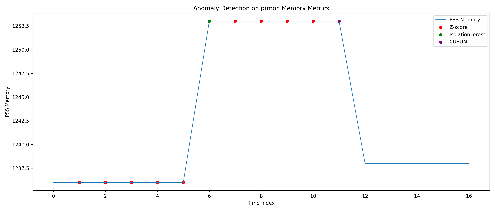
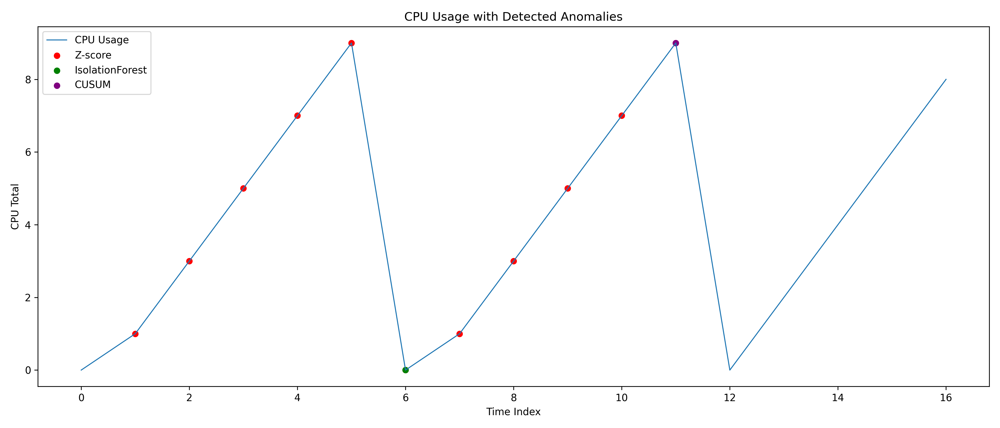

# Automated Anomaly Detection on prmon Resource Monitoring Data

This repository explores **process resource monitoring and anomaly detection** using time-series metrics generated with **prmon**, a lightweight process monitoring tool widely used in High Energy Physics workflows.

The goal of this experiment is to investigate how different anomaly detection approaches behave on **resource consumption time-series data**, and to evaluate their ability to detect injected anomalies in realistic workload scenarios.

The dataset is intentionally small because it was generated from short prmon burner experiments for demonstration purposes.

The project was implemented as a response to the warm-up exercise for the **CERN-HSF Google Summer of Code project: Automated Software Performance Monitoring for the ATLAS experiment.**


---

# Overview

Large scientific computing workflows such as those used by the **ATLAS experiment at CERN** run thousands of jobs across distributed computing infrastructures.

Monitoring job resource consumption is critical for detecting:

* software performance regressions
* inefficient workflows
* unexpected runtime behaviour
* resource leaks in long-running jobs

Tools such as **prmon** record detailed metrics for each running process. These metrics form time-series data streams that can be analyzed to automatically detect anomalous behaviour.

This repository demonstrates a small prototype pipeline that:

1. Generates monitoring data using `prmon`
2. Injects artificial anomalies using modified workloads
3. Applies multiple anomaly detection methods
4. Visualizes detected anomalies
5. Compares detection behaviour across algorithms

---

# Data Generation

Monitoring data was generated using **prmon** together with the built-in workload generators provided in the repository (`burner` tests).

Three experimental scenarios were created.

| Dataset         | Description                            |
| --------------- | -------------------------------------- |
| Normal workload | baseline resource usage                |
| CPU anomaly     | increased computational workload       |
| Heavy anomaly   | significantly increased resource usage |

The following commands were used to generate the datasets.

```bash
./package/prmon --interval 1 --filename prmon_normal.txt -- ./package/tests/burner 60
./package/prmon --interval 1 --filename prmon_cpu_anomaly.txt -- ./package/tests/burner 60 4
./package/prmon --interval 1 --filename prmon_heavy_anomaly.txt -- ./package/tests/burner 60 8
```

Each run produces a time-series file containing metrics sampled at regular intervals.

Important monitored metrics include:

| Metric | Meaning                                                 |
| ------ | ------------------------------------------------------- |
| PSS    | proportional set size (memory actually used by process) |
| RSS    | resident set size (total memory allocated)              |
| utime  | user CPU time                                           |
| stime  | system CPU time                                         |

For the analysis we derive:

```
cpu_total = utime + stime
```

These metrics capture both **memory behaviour and CPU consumption**, which are key signals in software performance monitoring.

---

# Feature Engineering

The anomaly detection algorithms operate on the following feature set:

```
pss
rss
cpu_total
```

For the machine learning detector, temporal context was incorporated by embedding **lagged observations** into the feature space.

For each time step (t), the model receives a vector of the form:

```
[x_t, x_{t-1}, x_{t-2}, x_{t-3}]
```

This allows the model to detect patterns such as:

* gradual memory growth
* sustained CPU increase
* unusual temporal behaviour

instead of only detecting isolated spikes.

Lagged feature vectors were constructed efficiently using **NumPy sliding window views**, avoiding expensive DataFrame copying operations.

---

# Detection Methods

Three anomaly detection approaches were implemented and compared.

## Rolling Z-Score

A rolling baseline is computed using a sliding window mean and standard deviation.

An anomaly is flagged when:

[
|x - \mu| / \sigma > threshold
]

This method is simple and interpretable but sensitive to noise and short spikes.

---

## CUSUM Change Detection

CUSUM (Cumulative Sum Control Chart) detects sustained shifts in the mean of a time series.

The algorithm accumulates deviations from the expected value:

[
S_t = max(0, S_{t-1} + x_t - \mu - k)
]

When the accumulated deviation exceeds a threshold, a persistent behavioural change is detected.

CUSUM is particularly useful for identifying **performance regressions or gradual memory leaks**.

---

## Isolation Forest

Isolation Forest is an unsupervised machine learning method designed for anomaly detection.

The algorithm isolates anomalous observations by recursively partitioning the feature space using random trees.

Advantages include:

* no assumptions about data distribution
* ability to detect multivariate anomalies
* effective performance on heterogeneous metrics

Temporal lag features were used so the model analyzes short sequences of behaviour rather than individual observations.

---

# Results

Example output from the detection pipeline:

```
Detection Summary
-----------------
Z-score anomalies: 11
CUSUM anomalies: 1
IsolationForest anomalies: 1
```
# Evaluation

The three anomaly detection methods exhibit different detection behaviours due to the type of anomalies they are designed to detect.
| Method           | Detection Type                 | Observed Behaviour                                |
| ---------------- | ------------------------------ | ------------------------------------------------- |
| Z-Score          | Spike detection                | Flags short spikes relative to a rolling baseline |
| CUSUM            | Change detection               | Detects sustained shifts in system behaviour      |
| Isolation Forest | Multivariate anomaly detection | Detects unusual combinations of metrics           |

Z-score flagged a larger number of anomalies because it is sensitive to local deviations from the rolling baseline.

CUSUM produced fewer detections because it is designed to identify persistent shifts in the mean behaviour, rather than short spikes.

Isolation Forest detected anomalies only when the joint distribution of CPU and memory metrics became unusual, making it more selective.

This difference highlights why monitoring systems often combine statistical and machine learning detectors.


Interpretation:

| Method           | Behaviour                             |
| ---------------- | ------------------------------------- |
| Z-Score          | detects short spikes and noise        |
| CUSUM            | detects sustained behavioural shifts  |
| Isolation Forest | detects unusual multi-metric patterns |

The detectors capture different anomaly types, which is expected for monitoring systems.

---

# Visualization

Detected anomalies are overlaid on the monitored time series.

The figure below shows memory usage (PSS) with anomalies detected by each algorithm.



This visualization illustrates how different algorithms respond to changes in system behaviour.

---

## CPU Behaviour

In addition to memory usage, CPU utilisation was analysed using the derived metric:

```
cpu_total = utime + stime
```

where:

* **utime** represents the user CPU time consumed by the process
* **stime** represents the system CPU time consumed by the process

Monitoring CPU behaviour is important because anomalous workloads often manifest as sudden increases in CPU consumption or unusual execution patterns.

The figure below shows the CPU usage over time together with anomalies detected by the three implemented methods.



### Interpretation

The anomaly markers correspond to observations where the detection algorithms identified unusual CPU behaviour relative to the baseline workload.

Each detector highlights different characteristics of the signal:

| Method           | Behaviour                                            |
| ---------------- | ---------------------------------------------------- |
| Z-Score          | Detects sudden spikes relative to a rolling baseline |
| CUSUM            | Detects sustained shifts in CPU behaviour            |
| Isolation Forest | Detects multivariate anomalies across metrics        |

Combining statistical and machine learning detectors allows the monitoring pipeline to capture both **short-term spikes and longer-term behavioural changes** in system resource usage.

---

# Reproducibility

To reproduce the experiment:

Install dependencies:

```bash
pip install pandas numpy matplotlib scikit-learn
```

Run the analysis pipeline:

```bash
python scripts/detect_anomalies.py
```

This script will:

1. load the generated prmon datasets
2. compute anomaly detection results
3. generate anomaly visualizations
4. print a summary of detected anomalies

---

# Repository Structure

```
prmon-anomaly-detection
│
├── data
│   prmon_normal.txt
│   prmon_cpu_anomaly.txt
│   prmon_heavy_anomaly.txt
│
├── scripts
│   anomalies.py
│   detect_anomalies.py
│
├── plots
│   anomaly_detection.png
│
└── README.md
```

---

# Discussion

This experiment demonstrates how different anomaly detection strategies can complement each other in monitoring pipelines.

* **Z-Score** provides rapid spike detection
* **CUSUM** detects persistent behavioural changes
* **Isolation Forest** captures multivariate anomalies

Combining these methods can provide a robust monitoring framework capable of identifying both short-term anomalies and long-term performance regressions.

Although this experiment uses synthetic workloads generated with prmon burner tests, the same approach can be applied directly to real monitoring data from large-scale scientific workflows.

---

# Notes on AI Assistance

AI assistance was used for:

* reviewing code structure
* validating algorithm implementations
* proofreading documentation

All experimental design, anomaly injection, and algorithm validation were performed manually.

---
# Future Work

The prototype implemented here can be extended in several ways to support large-scale software performance monitoring.

Possible extensions include:

real-time anomaly detection on streaming monitoring data

integration with monitoring dashboards

detection of anomalies across large job populations

automated alerting when performance regressions are detected

In large experiments such as ATLAS, such automated monitoring systems can help developers quickly identify unexpected changes in software performance across distributed computing workflows.

# References

Isolation Forest
Liu, Ting, Zhou (2008)

CUSUM Control Charts
Page (1954)

prmon Process Monitor
HSF / WLCG Collaboration

---

